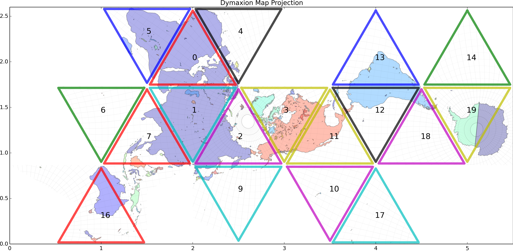

# Dymaxion Projections
This is a simple geodetic conversion tool for conversion from Lat/Lon to Dymaxion Fuller Map Projection Coordinates.


though pixel coordinate conversion becomes


The conversion routine is as follows. The specified (lon,lat) pair is first converted to spherical coordinates, then cartesian. That value is then used to determine the face number (0-19) and sub-triangle (0-5) on the icosahedron. All this information is then fed into a final subroutine that outputs an (X,Y) position pair suitable for mapping. Results from conversion are cached so repeated calls query a lookup-table first. Note that this is not [WGS84](http://en.wikipedia.org/wiki/World_Geodetic_System#A_new_World_Geodetic_System:_WGS_84) accurate due to the spherical conversion routine in use.



Technically, to unfold the earth into an icosahedron, we must first consider slicing the surface using various intersecting great circle patterns. This results in 20 spherical triangles. Each spherical triangle contain 6 of what Buckminster Fuller called LCD (Lowest Common Denominator) triangles. In *pydymax* these are ordered in a clockwise fashion.


All images in `/docs` and on this page are created by running `python3 -m dymax.examples`.

## To-Do List
1) Replace spherical coordinate conversion with Earth-Centered-Earth-Fixed for much better accuracy.
2) Get documentation working correctly.

## Install
```
pip install dymax
python3 -m dymax.examples
```

## Develop
```
git clone https://github.com/Teque5/pydymax
python3 setup.py develop
python3 -m dymax.examples
```

## Usage
```python
import dymax
xy_projection = dymax.lonlat2dymax(-118.0367, 34.8951)
```

## Data Sources
* [**ETOPO1**](https://www.ngdc.noaa.gov/mgg/global/global.html) is a 1 arc-minute global relief model of Earth's surface that integrates land topography and ocean bathymetry. It is generated by [NOAA](noaa.gov) and is Public Domain.
* [Blue Marble Next Generation](http://visibleearth.nasa.gov/view.php?id=73570) (**BMNG**) is generated by [NASA](nasa.gov) and is public-domain. This is the worldmap most-commonly seen by GIS users.
* [Global Self-consistent, Hierarchical, High-resolution Geography Database](http://www.ngdc.noaa.gov/mgg/shorelines/gshhs.html) (**GSHHS**) is generated by [NOAA](noaa.gov) and is licensed [GNU Lesser General Public License](http://www.gnu.org/licenses/lgpl.html). It contains excellent coastline data that is used in examples.

## License
*pydymax* code is [Attribution-NonCommercial-ShareAlike 4.0 International (CC BY-NC-SA 4.0)](http://creativecommons.org/licenses/by-nc-sa/4.0/)

## References
* [Mike Bostock's](https://github.com/mbostock) [javascript code](http://mbostock.github.io/protovis/ex/dymax.js) and [http://mbostock.github.io/protovis/ex/dymax.html](live demo)
* [general info on dymax/fuller projections](http://www.progonos.com/furuti/MapProj/Normal/ProjPoly/projPoly3.html)
* [The big wiki article on Dymaxion Maps](http://en.wikipedia.org/wiki/Dymaxion_map)
